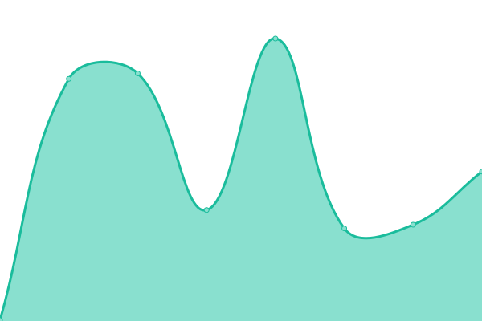
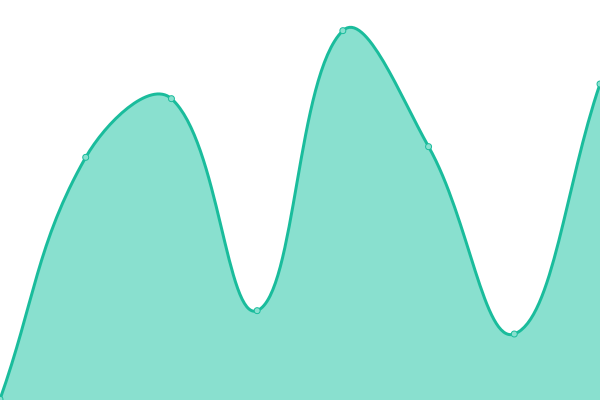

# [📈 Live Status](https://devalfe.github.io/uptimeinnova): <!--live status--> **🟩 All systems operational**

This repository contains the open-source uptime monitor and status page for [Félix Franco](https://devalfe.github.io/uptimeinnova), powered by [Upptime](https://github.com/upptime/upptime).

With [Upptime](https://upptime.js.org), you can get your own unlimited and free uptime monitor and status page, powered entirely by a GitHub repository. We use [Issues](https://github.com/devalfe/uptimeinnova/issues) as incident reports, [Actions](https://github.com/devalfe/uptimeinnova/actions) as uptime monitors, and [Pages](https://devalfe.github.io/uptimeinnova) for the status page.

<!--start: status pages-->
<!-- This summary is generated by Upptime (https://github.com/upptime/upptime) -->
<!-- Do not edit this manually, your changes will be overwritten -->
<!-- prettier-ignore -->
| URL | Status | History | Response Time | Uptime |
| --- | ------ | ------- | ------------- | ------ |
|  [Investor Innova-Funding](https://investor.innova-funding.com/) | 🟩 Up | [investor-innova-funding.yml](https://github.com/devalfe/uptimeinnova/commits/HEAD/history/investor-innova-funding.yml) | 

 198ms
     
 | 

<a href="https://devalfe.github.io/uptimeinnova/history/investor-innova-funding">100.00%</a>
    

|  [onBoarding Innova-Funding](https://onboarding.innova-funding.com/) | 🟩 Up | [on-boarding-innova-funding.yml](https://github.com/devalfe/uptimeinnova/commits/HEAD/history/on-boarding-innova-funding.yml) | 

 238ms
     
 | 

<a href="https://devalfe.github.io/uptimeinnova/history/on-boarding-innova-funding">100.00%</a>
    

|  [Company Innova-Funding](http://company.innova-funding.com/) | 🟩 Up | [company-innova-funding.yml](https://github.com/devalfe/uptimeinnova/commits/HEAD/history/company-innova-funding.yml) | 

 258ms
     
 | 

<a href="https://devalfe.github.io/uptimeinnova/history/company-innova-funding">100.00%</a>
    

|  [BackOffice Innova-Funding](http://backoffice.innova-funding.com/) | 🟩 Up | [back-office-innova-funding.yml](https://github.com/devalfe/uptimeinnova/commits/HEAD/history/back-office-innova-funding.yml) | 

 244ms
     
 | 

<a href="https://devalfe.github.io/uptimeinnova/history/back-office-innova-funding">100.00%</a>
    

<!--end: status pages-->

[**Visit our status website →**](https://devalfe.github.io/uptimeinnova)

## 📄 License

- Powered by: [Upptime](https://github.com/upptime/upptime)
- Code: [MIT](./LICENSE) © [Félix Franco](https://devalfe.github.io/uptimeinnova)
- Data in the `./history` directory: [Open Database License](https://opendatacommons.org/licenses/odbl/1-0/)
